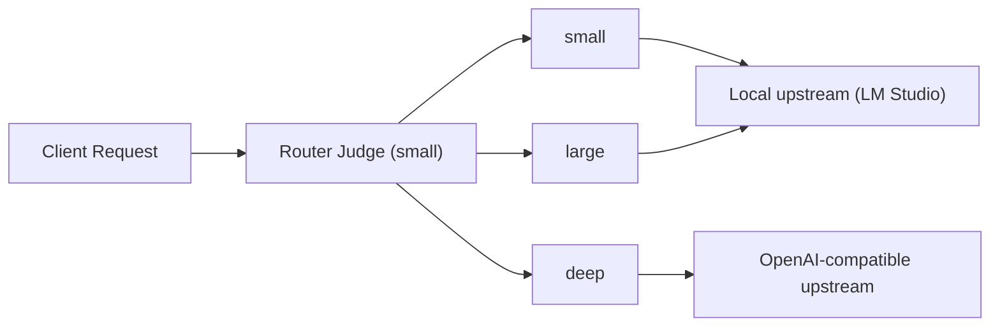

<p align="center">
  
</p>

<h1 align="center">LM Router</h1>
<p align="center"><b>OpenAI + Anthropic compatible router for local and deep reasoning models</b></p>

<p align="center">
  
  
  
</p>

---

## Why This Project

LM Router exposes one stable API surface while selecting the best upstream model automatically:

- `small` for fast, low-latency tasks
- `large` for coding and heavy local workloads
- `deep` for high-stakes, multi-step reasoning and compliance-heavy prompts

It supports OpenAI-compatible endpoints (`/v1/chat/completions`, `/v1/completions`) and an Anthropic-compatible MVP endpoint (`/v1/messages`).

---

## Quick Start

### 1. Install

```powershell
pip install -r requirements.txt
```

### 2. Prepare local config

```powershell
copy .env.example .env
copy config\router_config.example.yaml config\router_config.yaml
```

Set in `.env`:

```dotenv
DEEP_ENABLED=true
DEEP_API_KEY=<your_key>
DEEP_BASE_URL=https://api.openai.com
DEEP_MODEL_ID=gpt-5.4-mini
```

### 3. Start router

```powershell
python -m llmrouter
```

Tray mode:

```powershell
python -m llmrouter --tray
```

PowerShell launcher:

```powershell
powershell -ExecutionPolicy Bypass -File scripts/start_llm_router.ps1
```

### 4. Open admin UI

- [http://127.0.0.1:12345/admin](http://127.0.0.1:12345/admin)
- [http://127.0.0.1:12345/admin/status](http://127.0.0.1:12345/admin/status)

---

## Routing View



Behavior highlights:

- required aliases: `small`, `large`, `deep`
- capability and context window checks are applied before final selection
- `DEEP_ENABLED=true` is required for `deep` routing
- `x-router-selected-model` always shows the effective target model
- `x-router-thinking-requested` / `x-router-thinking-applied` expose thinking decision vs applied mode

---

## API Endpoints

- `POST /v1/chat/completions`
- `POST /v1/completions`
- `POST /v1/messages` (Anthropic-compatible MVP)
- `GET /v1/models`
- `GET /healthz`
- `GET /admin`
- `GET /admin/status`
- `GET /admin/config`
- `PUT /admin/config`
- `GET /admin/model-availability`

---

## Configuration

Main runtime config:

- `config/router_config.yaml` (ignored by git)
- `config/router_config.example.yaml` (committed template)

Important knobs:

- `server.host`
- `server.port` (default `12345`)
- `routing.heuristics.*` for judge tuning
- `router_identity.exposed_model_name` (default `borg-cpu`)
- `models.<alias>.upstream_ref` for per-model upstream mapping
- `models.<alias>.supports_thinking` to mark if a model can run with thinking enabled

Deep defaults used in this project:

- model: `gpt-5.4-mini`
- context: `400000`

---

## Logging

- file log: `logs/router.log`
- request correlation via `x-request-id`
- relevant env vars:
  - `ROUTER_LOG_LEVEL`
  - `ROUTER_LOG_FILE`
  - `ROUTER_LOG_MAX_BYTES`
  - `ROUTER_LOG_BACKUP_COUNT`
  - `ROUTER_TOOLUSE_SYSTEM_HINT`

---

## Testing

### Deep connection test (PowerShell)

```powershell
powershell -ExecutionPolicy Bypass -File scripts/test_deep_connection.ps1
```

Optional:

```powershell
powershell -ExecutionPolicy Bypass -File scripts/test_deep_connection.ps1 -RouterUrl http://127.0.0.1:12345 -DeepModel gpt-5.4-mini -BearerToken <TOKEN>
```

The script:

- validates `.env` (`DEEP_ENABLED`, `DEEP_API_KEY`)
- sends a test request to `/v1/chat/completions`
- logs `x-router-selected-model`, `x-router-reason`, `x-router-judge-model`
- writes a session log to `outputs/deep_connection_test_*.log`
- extracts correlated lines from `logs/router.log` via `x-request-id`

### Demo request script

```powershell
python demo_requests.py --router-url http://127.0.0.1:12345
```

Optional auth:

```powershell
python demo_requests.py --token <TOKEN>
```

### Live vision + story test

`live_router_tests.py` generates a local PNG and a multi-page story output.

Example run:

```powershell
uv run --with fastapi --with httpx --with pyyaml --with pydantic live_router_tests.py
```

Artifacts:

- `outputs/child_with_bouquet.png`
- `outputs/baeren_4_seiten_geschichte.txt`

---

## Tray Mode

- custom LM Router icon in system tray
- status indicator (`green = running`, `red = stopped`)
- tray actions:
  - `Settings oeffnen`
  - `Status oeffnen`
  - `Router starten` / `Router stoppen`
  - `Beenden`
- Windows startup toggle is available in `/admin`
- startup uses `HKCU\Software\Microsoft\Windows\CurrentVersion\Run` and launches `scripts/start_llm_router.ps1`
